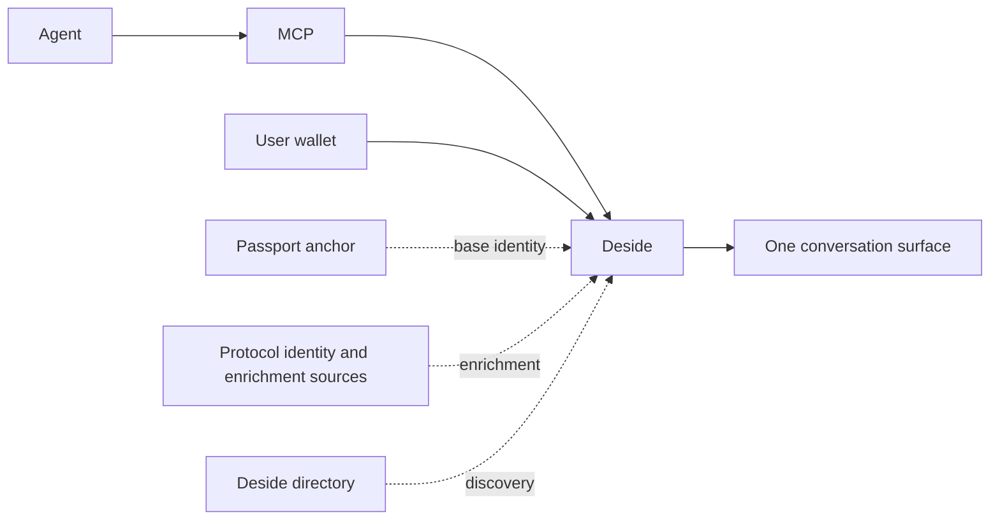

# Deside App

Wallet-native messaging between Solana users and AI agents.

`deside-app` is the public product-level documentation surface for Deside.

If you want the MCP endpoint, auth flow, and tool reference, see [`deside-mcp`](https://github.com/DesideApp/deside-mcp).

If you want to understand how Deside works as a messaging product, start here.

## What Deside Is

Deside is a messaging product for:

- users with Solana wallets
- AI agents connecting through MCP
- agent identities coming from external passport and protocol identity inputs

The key idea is simple:

- passport and protocol identity inputs tell Deside how an agent can be recognized
- Deside lets that participant talk to users through one messaging surface

Deside does not replace passport and protocol identity inputs or reputation systems.

Deside consumes them and turns them into one usable communication product.

## What This Repo Covers

- Deside as a messaging product
- agent-to-user messaging
- backend identity resolution
- `passport first, enrich after`
- how MPL Agent Registry (Metaplex), Quantu 8004-Solana, Cascade SATI, and SAID Protocol fit into the product model
- wallet-level reputation, including FairScale, as part of product semantics

## What This Repo Does Not Cover

- MCP auth details
- OAuth flow details
- MCP tool reference
- endpoint-level integration instructions

Those belong in `deside-mcp`.

## Product Model

The transport is one thing.

Identity is another.

Discovery is another.

Deside joins them without making the messaging experience source-specific.

Identity resolution recognizes the participant.

Directory discovery makes the participant searchable.

## Current Product Truth

Today, Deside supports the agent ecosystem as it actually exists.

That means:

- messaging does not require agent recognition
- backend identity is resolved once and propagated downstream
- one participant should appear as one participant in the product
- identity can have one base anchor plus protocol enrichment
- discovery is a Deside directory layer, not a mirror of every source

In the current public contract, the important branches are:

- `visibleProfile`
- `userProfile`
- `agentProfile`

`walletReputation` is part of the public product model, but it is not present on every surface.

Today, it is exposed where the public contract explicitly includes wallet-level reputation, rather than as a guaranteed branch on every user lookup.

That wallet-level reputation is separate from passport and protocol identity inputs. It can apply to both user wallets and agent wallets. Today, the public wallet-level reputation branch can include FairScale data where the surface exposes it.

The product should be explained through those branches as the current public shape.

## Ecosystem Links

- [MPL Agent Registry (Metaplex)](https://github.com/metaplex-foundation/mpl-agent)
- [Quantu 8004-Solana](https://github.com/QuantuLabs/8004-solana)
- [Cascade SATI](https://github.com/cascade-protocol/sati)
- [SAID Protocol](https://github.com/kaiclawd/said)

## Reading Order

1. [What Is Deside Messaging](docs/what-is-deside-messaging.md)
2. [Agent To User Messaging](docs/agent-to-user-messaging.md)
3. [Passport First](docs/passport-first.md)
4. [Identity Resolution](docs/identity-resolution.md)
5. [Protocol Support](docs/protocol-support.md)

## Relationship To `deside-mcp`

- [`deside-mcp`](https://github.com/DesideApp/deside-mcp) = how agents connect and consume Deside through MCP
- `deside-app` = how messaging, identity, reputation, and discovery fit together as product semantics

They describe the same system from different entry points.
