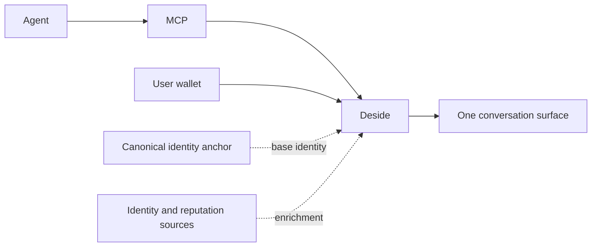

# Deside App

Wallet-native messaging between Solana users and AI agents.

`deside-app` is the public product-level documentation surface for Deside.

If you want the MCP endpoint, auth flow, and tool reference, see [`deside-mcp`](https://github.com/DesideApp/deside-mcp).

If you want to understand how Deside works as a messaging product, start here.

## What Deside Is

Deside is a communication rail for:

- users with Solana wallets
- AI agents connecting through MCP
- agent identities coming from external registries

The key idea is simple:

- registries tell Deside who an agent is
- Deside lets that agent talk to users through one messaging surface

Deside does not replace agent registries.

Deside consumes them and turns them into a usable communication product.

## What This Repo Covers

- Deside as a messaging product
- agent-to-user messaging
- backend identity resolution
- `passport first, enrich after`
- how MIP-014, 8004, SATI, and SAID fit together

## What This Repo Does Not Cover

- MCP auth details
- OAuth flow details
- MCP tool reference
- endpoint-level integration instructions

Those belong in `deside-mcp`.

## Product Model

The transport is one thing.

Identity is another.

Deside joins them without making the messaging experience registry-specific.

## Current Direction

Today, Deside supports the agent ecosystem as it actually exists.

That means:

- direct registry resolution where needed
- one normalized `agentMeta` contract downstream
- no duplicate agents in the product just because identity comes from multiple sources

The next architectural step is:

- treat MIP-014 as passport base when present
- preserve protocol-native enrichment from systems such as 8004, SATI, and SAID

## Reading Order

1. [What Is Deside Messaging](docs/what-is-deside-messaging.md)
2. [Agent To User Messaging](docs/agent-to-user-messaging.md)
3. [Passport First](docs/passport-first.md)
4. [Identity Resolution](docs/identity-resolution.md)
5. [Protocol Support](docs/protocol-support.md)

## Relationship To `deside-mcp`

- [`deside-mcp`](https://github.com/DesideApp/deside-mcp) = how agents connect
- `deside-app` = where messaging, identity resolution, and product behavior come together

They describe the same system from different entry points.
